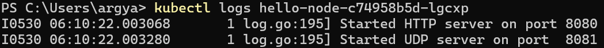
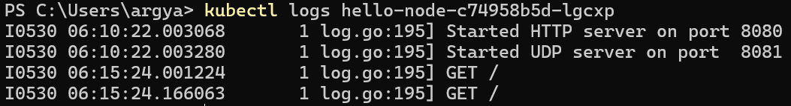
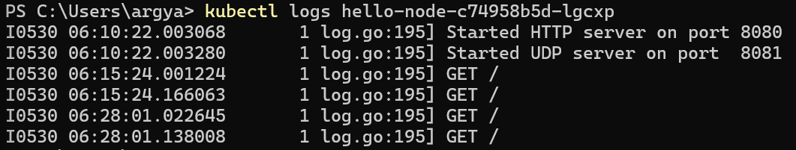

# Reflection on Hello Minikube Tutorial

## 1. Application Logs Comparison: Before and After Service Exposure

### Before Exposing as a Service

The image above shows the condition of the logs before I exposed the application as a Service. No matter how many times I tried to access the application on port 8080, it never worked and the logs remained unchanged, showing only the initial startup messages.

### After Exposing as a Service

After exposing the application as a Service, two new log lines appeared - the `GET /` entries - indicating that I successfully accessed the application with GET requests.

### Multiple Access Attempts

When I revisited the application multiple times, the logs increased by 2 lines each time with identical content but different timestamps, demonstrating that each browser access generates new log entries.

**Key Observation:** The number of logs increases each time the application is accessed through the exposed Service, proving that the Service successfully routes external traffic to the pod.

## 2. Understanding the `-n` Option and Kubernetes Namespaces

The difference between the two versions of `kubectl get` commands highlights an important Kubernetes concept: **namespaces**.

### Default Namespace Behavior
When using `kubectl get pods` or `kubectl get services` without additional options, the command queries resources in the **default namespace** where user-created applications typically reside. This is why the hello-node deployment, pod, and service appear in these results.

### The `kube-system` Namespace
When using `kubectl get pods,services -n kube-system`, the `-n` option specifies the **kube-system namespace**, which is reserved for Kubernetes system components and infrastructure services. This namespace contains critical cluster components such as:

- DNS service (coredns)
- API server
- Controller manager
- Scheduler
- Metrics-server addon (from this tutorial)

### Purpose of Namespace Separation
System components are deliberately separated from user applications to provide:

- **Better organization** of cluster resources
- **Enhanced security** by isolating system-critical services
- **Improved management** capabilities
- **Protection** from accidental modification or deletion by users
- **Clean separation of concerns** between infrastructure and application workloads

The namespace isolation ensures that system-critical services remain protected while allowing users to work freely with their applications in the default namespace.