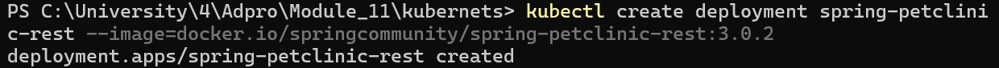

# Reflection on Hello Minikube Tutorial

## 1. Application Logs Comparison: Before and After Service Exposure

### Before Exposing as a Service


The image above shows the condition of the logs before I exposed the application as a Service. No matter how many times I tried to access the application on port 8080, it never worked and the logs remained unchanged, showing only the initial startup messages.

### After Exposing as a Service


After exposing the application as a Service, two new log lines appeared - the `GET /` entries - indicating that I successfully accessed the application with GET requests.

### Multiple Access Attempts


When I revisited the application multiple times, the logs increased by 2 lines each time with identical content but different timestamps, demonstrating that each browser access generates new log entries.

**Key Observation:** The number of logs increases each time the application is accessed through the exposed Service, proving that the Service successfully routes external traffic to the pod.

## 2. Understanding the `-n` Option and Kubernetes Namespaces

The difference between the two versions of `kubectl get` commands highlights an important Kubernetes concept: **namespaces**.

### Default Namespace Behavior
When using `kubectl get pods` or `kubectl get services` without additional options, the command queries resources in the **default namespace** where user-created applications typically reside. This is why the hello-node deployment, pod, and service appear in these results.

### The `kube-system` Namespace
When using `kubectl get pods,services -n kube-system`, the `-n` option specifies the **kube-system namespace**, which is reserved for Kubernetes system components and infrastructure services. This namespace contains critical cluster components such as:

- DNS service (coredns)
- API server
- Controller manager
- Scheduler
- Metrics-server addon (from this tutorial)

### Purpose of Namespace Separation
System components are deliberately separated from user applications to provide:

- **Better organization** of cluster resources
- **Enhanced security** by isolating system-critical services
- **Improved management** capabilities
- **Protection** from accidental modification or deletion by users
- **Clean separation of concerns** between infrastructure and application workloads

The namespace isolation ensures that system-critical services remain protected while allowing users to work freely with their applications in the default namespace.

# Kubernetes Rolling Update & Manifest Files Reflection

## 1. Rolling Update vs Recreate Deployment Strategy

The primary difference between Rolling Update and Recreate deployment strategies lies in how they handle the transition from old to new application versions. Rolling Update strategy gradually replaces old pods with new ones while maintaining service availability throughout the entire update process. It works by creating new pods with the updated version while keeping the old pods running, then terminating the old pods only after the new ones are ready and healthy. This approach ensures zero downtime during updates and provides a gradual rollout that reduces risk, making it easy to rollback if issues occur since the service remains continuously available to users. However, Rolling Update requires more resources temporarily because both old and new pods run simultaneously, making the update process slower and creating a period where different versions of the application are running together.

In contrast, the Recreate strategy takes a more straightforward but disruptive approach by terminating all existing pods before creating new ones with the updated version. This strategy essentially scales the deployment down to zero replicas and then scales it back up with the new version. While this results in faster update processes and lower resource consumption during the update (since only one version runs at a time), it also causes service downtime that can negatively impact user experience. The Recreate strategy provides a clean cut between versions with no version mixing, making it simpler to manage, but it carries higher risk if the new version has issues since there's no immediate way to serve traffic during the transition period. The key trade-off is that Rolling Update prioritizes availability and user experience at the cost of resources and complexity, while Recreate prioritizes simplicity and resource efficiency at the cost of service availability.

## 2. Deploying Spring Petclinic REST with Recreate Strategy

### Steps to Deploy with Recreate Strategy:

1. **First, delete the existing deployment:**
   

2. **Create a new deployment with Recreate strategy:**
    
    


3. **Scale to multiple replicas:**
    


4. **Test the Recreate update:**
   

   In another terminal then i run the commands below:

   
   
   Then the output of the first terminal will be:
   

### Observed Behavior:
- All 4 pods were terminated simultaneously
- Brief period with 0 running pods (service unavailable)
- New pods created all at once with updated image
- Faster overall update time but with downtime

## 3. Manifest Files for Recreate Deployment Strategy

### deployment-recreate.yaml
```yaml
apiVersion: apps/v1
kind: Deployment
metadata:
  name: spring-petclinic-rest-recreate
  labels:
    app: spring-petclinic-rest
spec:
  replicas: 4
  strategy:
    type: Recreate
  selector:
    matchLabels:
      app: spring-petclinic-rest
  template:
    metadata:
      labels:
        app: spring-petclinic-rest
    spec:
      containers:
      - name: spring-petclinic-rest
        image: docker.io/springcommunity/spring-petclinic-rest:3.0.2
        ports:
        - containerPort: 9966
```

### service-recreate.yaml
```yaml
apiVersion: v1
kind: Service
metadata:
  name: spring-petclinic-rest-recreate
spec:
  type: LoadBalancer
  ports:
  - port: 9966
    targetPort: 9966
    protocol: TCP
  selector:
    app: spring-petclinic-rest
```

### Usage:
```bash
kubectl apply -f deployment-recreate.yaml
kubectl apply -f service-recreate.yaml
```
In order for the deployment strategy to take effect, you need to set the image into a newer version.
```bash
kubectl set image deployment/spring-petclinic-rest-recreate spring-petclinic-rest=docker.io/springcommunity/spring-petclinic-rest:3.2.1
```

## 4. Benefits of Using Kubernetes Manifest Files

Kubernetes manifest files offer significant advantages over manual deployment approaches by enabling **version control and reproducibility**. Unlike kubectl commands that are executed once and forgotten, YAML files can be stored in Git repositories, tracked over time, and deployed consistently across different environments. This eliminates the "it works on my machine" problem and ensures that development, staging, and production environments remain identical.

**Automation and scalability** represent another key benefit. Manifest files integrate seamlessly with CI/CD pipelines, enabling GitOps workflows where infrastructure changes are managed through code commits. This approach scales efficiently from single applications to hundreds of services, something that becomes unmanageable with manual commands.

The comparison between manual and manifest-based deployment is stark. Manual deployment using kubectl commands is excellent for learning and quick testing due to immediate feedback, but it's error-prone, not reproducible, and difficult to audit. Manifest file deployment requires initial setup and YAML knowledge but provides reproducible, version-controlled, and automated infrastructure management that's essential for production environments.

In practice, manifest files enable **disaster recovery** through quick infrastructure rebuilds, **team collaboration** through shared configurations, and **compliance** through audit trails of all changes. The transition from imperative kubectl commands to declarative manifest files represents a fundamental shift toward professional, maintainable Kubernetes deployments that can scale with organizational needs.